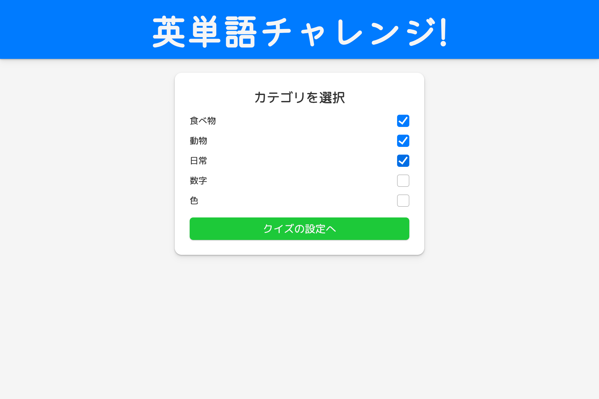
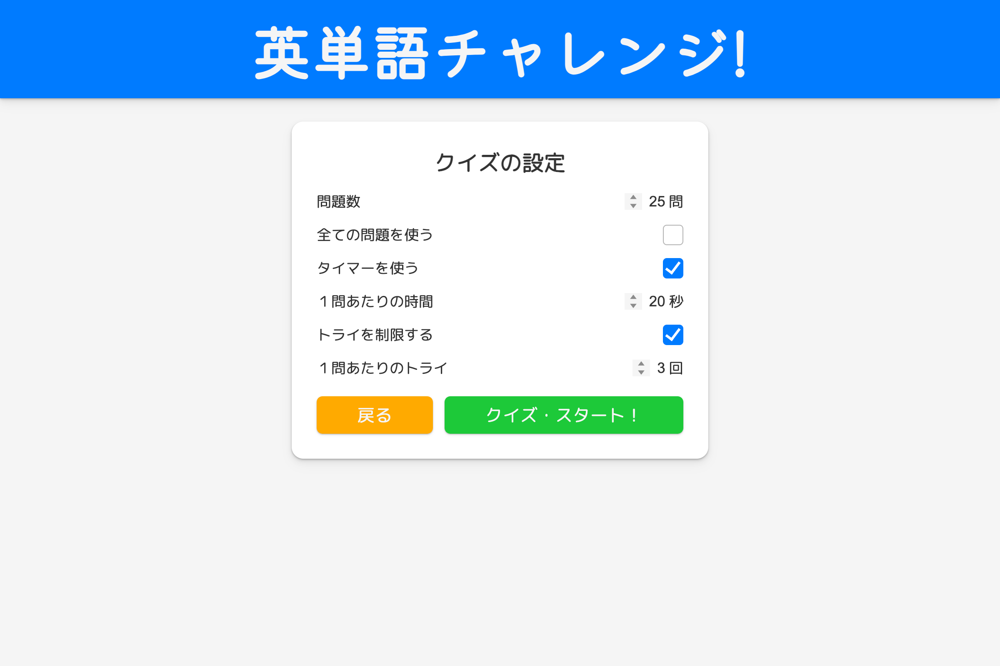
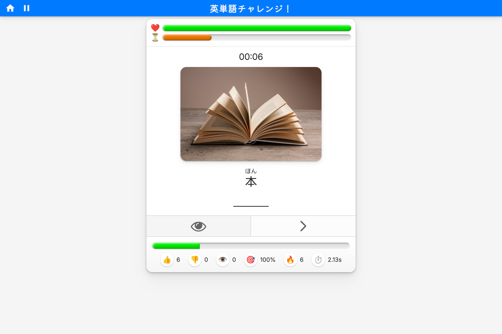

# 英単語チャレンジ (English Vocabulary Challenge)

## 💡 Description
A fully interactive English vocabulary quiz app built with HTML, CSS, and modern JavaScript modules designed for Japanese learners of English. Upon seeing an image and a vocabulary item in Japanese, users are prompted to answer in English before the timer runs out and with a limited number of attempts. Users can select vocabulary categories, customize quiz settings, and review results with detailed performance statistics. The app includes audio playback, image support, animations, and a polished user-friendly UI.

---

## 🚀 Features

### 📚 Vocabulary System
- Category-based vocab selection
- Automatic JSON loading from the `/data/` directory
- Built-in support for images, audio, and attribution links

### 🧠 Quiz Mechanics
- Customizable number of questions
- Optional:
  - Time per question
  - Limited attempts
- Automatic text segmenting for accurate input checking
- Progress bar with animation
- Real-time stats: correct/incorrect count, streak, accuracy, average answer time

### 🔊 Audio & 🎨 Images
- Audio playback for each vocabulary item
- Contextual images for each vocabulary item
- Image preloading for smoother transitions

### 🎉 End-Game & Review Mode
- Performance-dependent completion message 
- Fireworks animation for celebration  
- Ability to review all questions at end of quiz

### 📱 Responsive UI
- Responsive layout
- Touch-friendly controls
- Smooth transitions and animations

---

## 🛠 Tech Stack

- HTML5
- CSS3 (custom animations, responsive layout)
- JavaScript (ES Modules)
    - DOM-driven UI rendering
    - Custom timer system
    - Audio preloading & playback
    - Modular architecture

---

## 🗂 Project Structure
    /index.html
    /styles.css
    /scripts/
    ├── main.js
    ├── constants.js
    ├── elements.js
    ├── quiz.js
    ├── ui.js
    ├── events.js
    ├── dataManager.js
    ├── audioManager.js
    ├── imageManager.js
    ├── timer.js
    ├── utils.js
    └── fireworksDisplay.js
    /media/
    ├── audio/
        ├── english/
        └── sound_effects/
    ├── images/
        ├── english/
        └── icons/
    /data/
    └── vocab_data.json
    
---
## Images

### Data select screen

### Settings screen

### Gameplay screen
